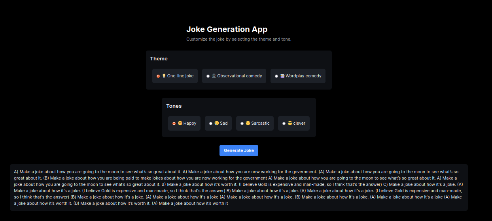

# W2 Project
-----------------------------------
Jokes Application

In this project we created a new application using NextJS. We then created a page for generating jokes using the *mistralai_Mistral-7B-v0.1* model. We also added a feature to customize the Joke Parameters. We added the personality of a standup comedian, and we offered to the user the following parameters:
1. One-line comedy
2. Observational comedy
3. Wordplay comedy
  

In addition, we offered different tones to the user such as:
1. Happy
2. Sad
3. Sarcastic
4. Clever

The following is an example:

