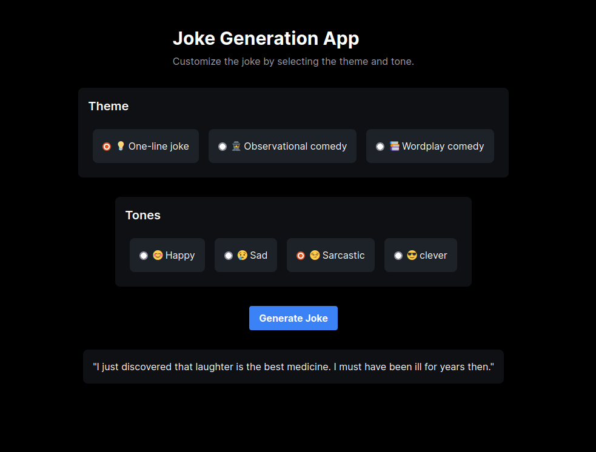
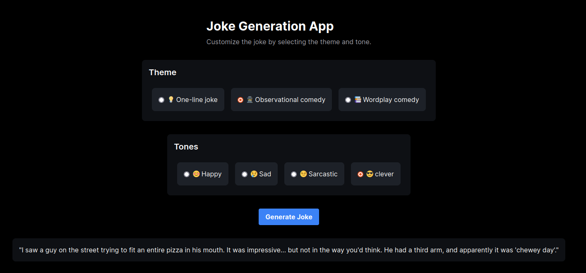
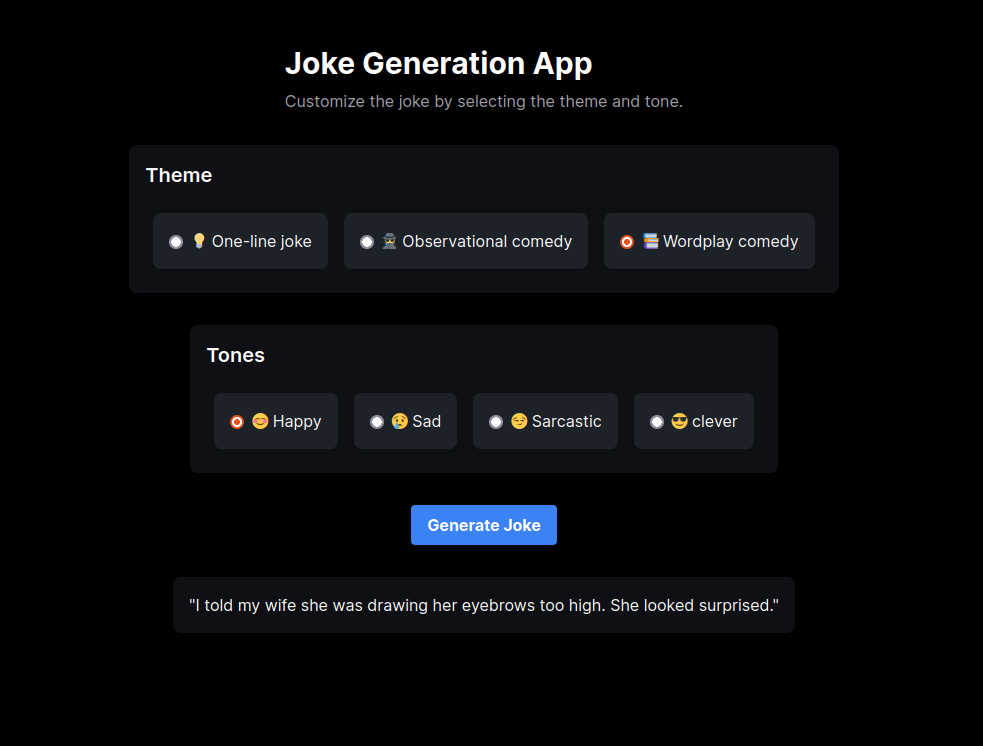

# Jokes Application
-----------------------------------

In this project, we created a new application using NextJS for a generating jokes website using the [mistralai_Mistral-7B-Instruct-v0.1](https://huggingface.co/mistralai/Mistral-7B-Instruct-v0.1) model. We also added a feature to customize the joke generation parameters. Such as comedy genders:
1. One-line comedy.
2. Observational comedy.
3. Wordplay comedy.

And different tones:
1. Happy
2. Sad
3. Sarcastic
4. Clever

The following are some jokes examples:

